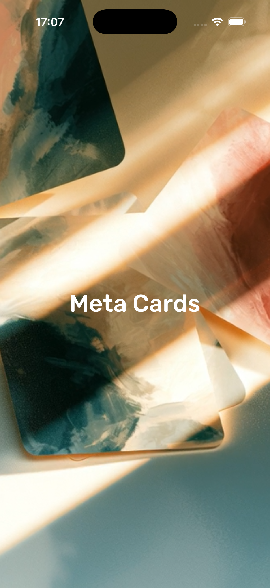
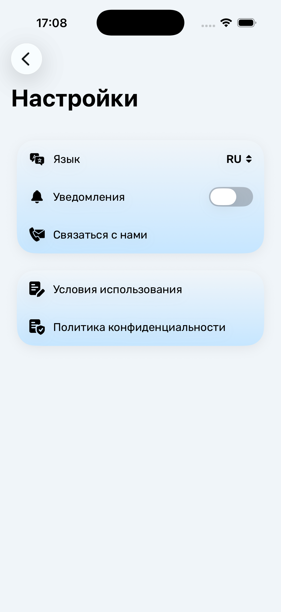

# 👋 Hi, I'm Ulvi Pashaev

### iOS Developer

Building polished native iOS applications with **Swift**, **UIKit** and **SwiftUI**.

 

---

# Meta Cards

### Designed for meaningful self-reflection.

A native iOS application built entirely from scratch using **SwiftUI**, **Combine**, **MVVM** and **Tuist**.

---

## Experience

<table>
<tr>

<td align="center">

  

### Browse Decks

Choose a deck based on your current emotional state.

</td>

<td align="center">

  

### Explore Cards

Quick search and random card selection.

</td>

</tr>

<tr>

<td align="center">

  

### Read & Reflect

Read detailed interpretations and reflect on your thoughts.

</td>

<td align="center">

  

### Personalize

Customize themes, font size and brightness.

</td>

</tr>

</table>

---

# Built with

---

## Contact

📬 **Email**

ulvidev@outlook.com

💬 **Telegram**

https://t.me/UlviPasha
