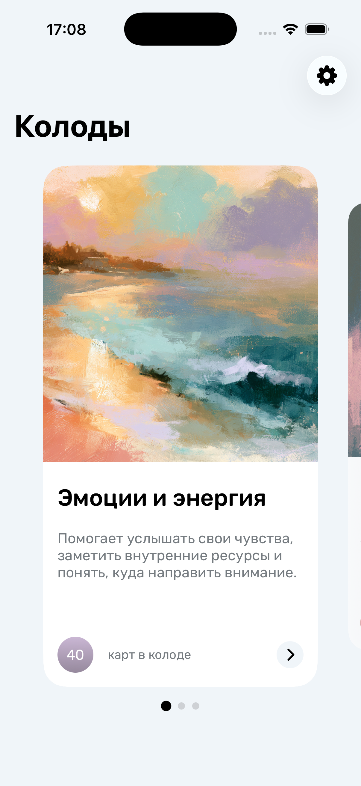
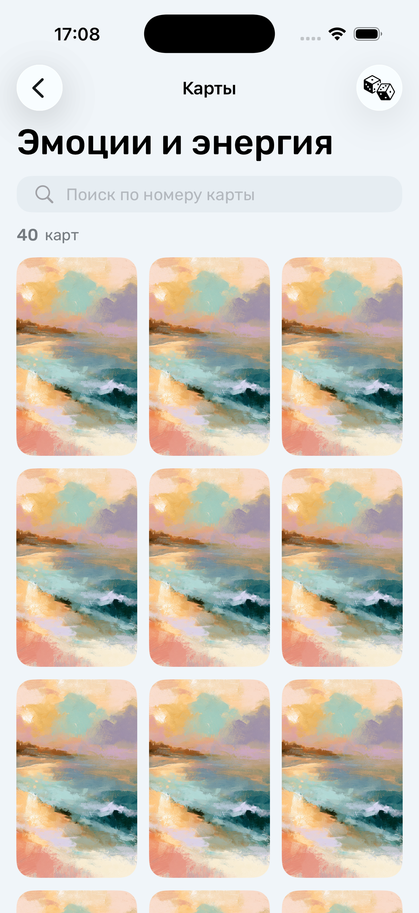
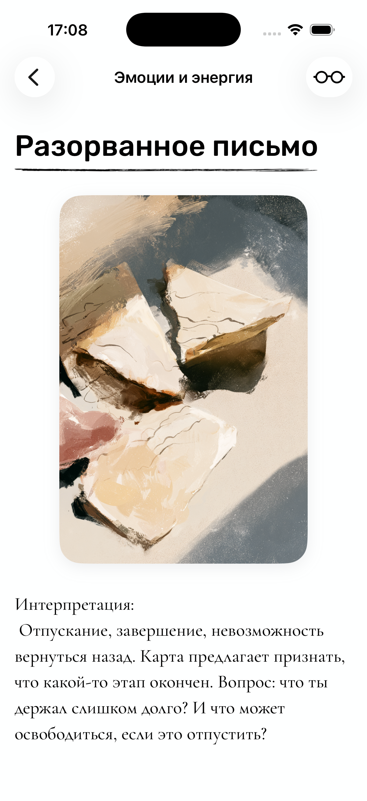

# Hi, I'm Ulvi Pashaev 👋

### iOS Developer

Building native iOS applications with **Swift**, **UIKit** and **SwiftUI**

 

---

# 📱 Published App

## Meta Cards

Native iOS application for working with metaphorical associative cards.

Built entirely from scratch using **SwiftUI**, **Combine**, **MVVM** and **Tuist**.

---

# ✨ Features

<table>
<tr>

<td align="center">

 

<b>Browse Decks</b>

Choose a deck based on your current state.

</td>

<td align="center">

 

<b>Explore Cards</b>

Quick search and random card selection.

</td>

<td align="center">

 

<b>Read & Reflect</b>

Read interpretations and personalize your reading experience.

</td>

</tr>
</table>

---

# 🛠 Tech Stack

---

# 💼 Other Projects

- 🏋️ **Workout Timer** *(Private Repository)*
- 📚 **Novels**
- ⚽ **Molnia-31**

---

# 📫 Contact

📬 **Email**

ulvidev@outlook.com

💬 **Telegram**

https://t.me/UlviPasha
